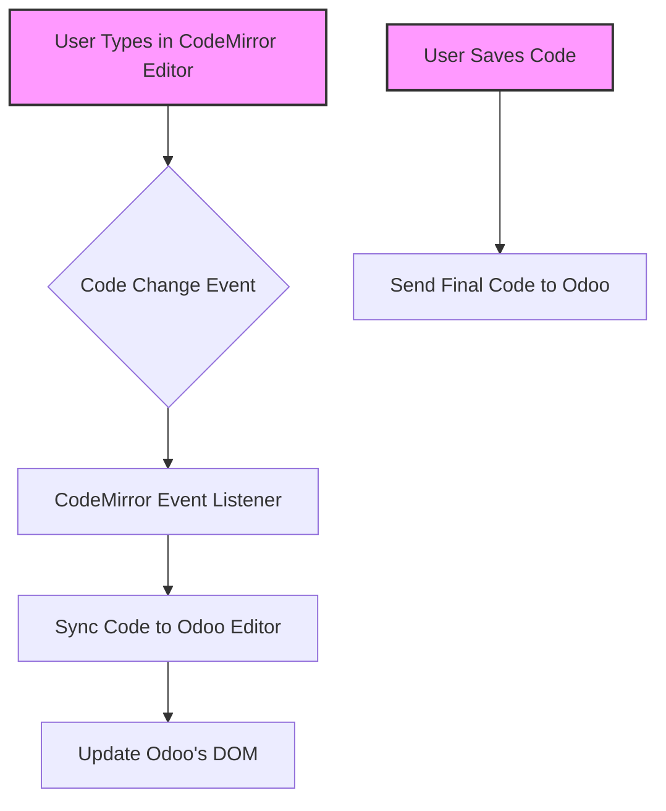

# Odoo-better-ide

## Overview
This project aims to enhance Odoo's in-browser code editor for Scheduled Actions by overlaying a **CodeMirror editor** with advanced features such as IntelliSense, syntax highlighting, and visual customization.

Key Features:
1. **Enhanced Code Editor:** Add a modern editor with CodeMirror.
2. **Real-Time Syncing:** Sync code between CodeMirror and the Odoo editor.
3. **Customizations:** Allow theme, font size, and keybinding adjustments.
4. **Ease of Use:** Include save and reset options for seamless integration.

---

## Architecture Diagram (Mermaid.js)

---

## Requirements

### Technologies:
1. **React CodeMirror:** CodeMirror component for React. A versatile text editor implemented in JavaScript for browsers.
2. **Chrome Extensions API:** For injecting scripts and interacting with web pages.

## Implementation Plan

### 1. Setup Chrome Extension
- Create the `manifest.json` file with required permissions:
  - `content_scripts` to inject CodeMirror into Odoo pages.
  - `storage` for saving user preferences (themes, fonts, etc.).

### 2. Inject CodeMirror
- Use `content_scripts` to identify Odoo's editor DOM.
- Replace the Odoo editor with a CodeMirror instance.
- Add `onChange` events in CodeMirror to sync code with Odoo.

### 3. Sync Code with Odoo
- Implement two-way syncing:
  - **CodeMirror → Odoo**: On every change, update Odoo’s original editor.
  - **Odoo → CodeMirror**: Listen for external changes (if any).

### 4. Add Customization Options
- Use a settings page or popup for:
  - Selecting themes.
  - Adjusting font sizes.
  - Configuring keybindings.

### 5. Save Code
- Implement a “Save to Odoo” button:
  - Send the final code to Odoo’s editor before submission.

### 6. Testing and Debugging
- Test across different Odoo versions to ensure compatibility.
- Handle edge cases (e.g., large scripts, invalid DOM detection).

## TODO Section

### Step-by-Step Checklist

#### 1. Chrome Extension Basics
- [ ] Create `manifest.json` with proper permissions (`activeTab`, `content_scripts`, `storage`).
- [ ] Build a minimal popup UI for toggling the extension.

#### 2. DOM Interaction
- [ ] Write a script to detect and modify the Odoo editor's DOM.
- [ ] Inject CodeMirror into the detected element.

#### 3. Two-Way Syncing
- [ ] Add `onChange` listeners to CodeMirror for syncing code to Odoo’s editor.
- [ ] Observe DOM mutations to detect changes in Odoo and update CodeMirror.

#### 4. Customization Features
- [ ] Implement a settings page or popup for themes, font sizes, and keybindings.
- [ ] Store user preferences using the Chrome `storage` API.

#### 5. Save Functionality
- [ ] Create a button to send the final code to Odoo’s editor.
- [ ] Ensure it integrates well with Odoo’s Scheduled Action submission process.

#### 6. Testing
- [ ] Test the extension on multiple Odoo versions.
- [ ] Ensure smooth performance with large scripts and heavy DOM usage.

#### 7. Deployment
- [ ] Package the Chrome extension.
- [ ] Publish it on the Chrome Web Store.
